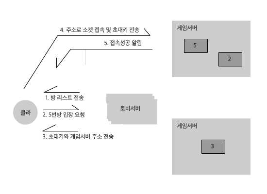
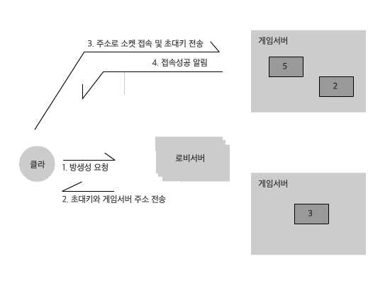

# 방입장 및 생성

## 방입장

1 로비서버의 GET # /rooms/를 이용해 방 리스트를 받아옵니다.

2 방리스트 중 입장하기를 원하는 방의 id 값을 알아둔 뒤 로비서버의 PUT # /rooms/{방의 id 값}으로 방 입장을 요청합니다.

3 뭔가 적절할 경우 초대키와 게임서버 주소가 응답으로 올겁니다.

4 위에서 얻은 게임서버 주소로 소켓 접속을 하고 초대키를 connect 명령에 담아 보냅니다. 

5 뭔가 적절할 경우 connected 이벤트가 올 것입니다. 아닐 경우 error 이벤트가 올 것입니다.

## 방생성

1 로비서버의 POST # /rooms/ 를 통해 방생성을 요청합니다.

2부터  방입장의 3부터와 동일합니다